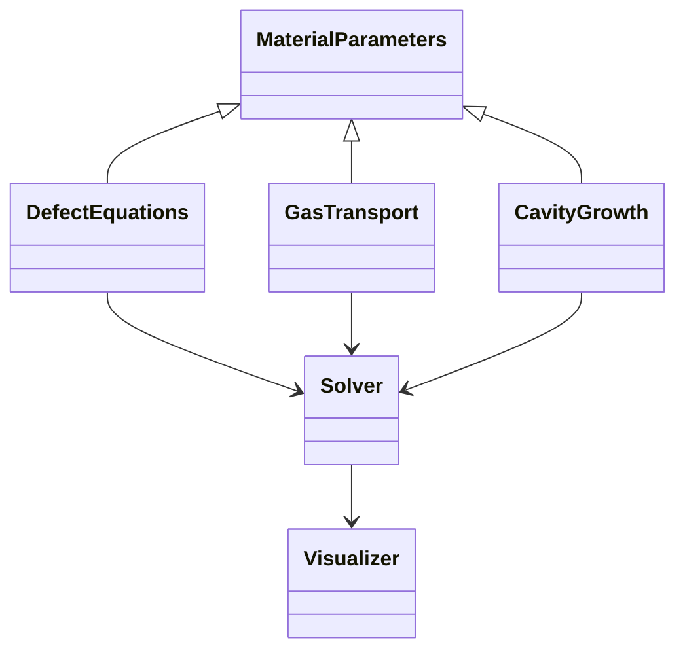

# 气体肿胀模型设计文档

## 1. 模型架构


## 2. 核心微分方程组实现

### 2.1 缺陷平衡方程 (公式17-18)
```python
class DefectEquations:
    def vacancy_equation(self, c_v, c_i, params):
        """
        dc_v/dt = φf - k_v²D_vc_v - αc_ic_v
        对应公式17
        """
        term1 = params.phi * params.fission_rate
        term2 = params.kv_sq * params.D_v * c_v
        term3 = params.alpha * c_i * c_v
        return term1 - term2 - term3

    def interstitial_equation(self, c_i, c_v, params):
        """
        dc_i/dt = φf - k_i²D_ic_i - αc_ic_v  
        对应公式18
        """
        # 实现类似空位方程
```

### 2.2 气体输运方程 (公式1-3)
```python
class GasTransport:
    def gas_concentration(self, c_g, c_c, params):
        """
        dc_g^b/dt 方程实现
        对应公式1
        """
        term1 = -16 * math.pi * params.Fb * ... # 完整公式实现
        # ...
        return total_rate
```

## 3. 数值求解方案

### 3.1 求解器选择
```python
from scipy.integrate import solve_ivp

class Solver:
    def solve(self, equations, t_span, y0):
        return solve_ivp(
            fun=equations.system,
            t_span=t_span,
            y0=y0,
            method='BDF',  # 适合刚性方程
            atol=1e-8,
            rtol=1e-6
        )
```

## 4. 测试计划

### 4.1 单元测试用例
```python
def test_steady_state():
    # 设置参数使dc/dt=0
    params = ...
    eq = DefectEquations(params)
    assert abs(eq.vacancy_equation(c_v_ss, c_i_ss)) < 1e-6
```

## 5. 实施路线图
1. 实现基础方程类 ✔️
2. 集成数值求解器
3. 添加稳定性监控
4. 开发可视化模块
5. 完整系统测试
